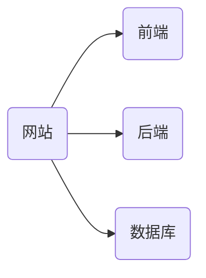
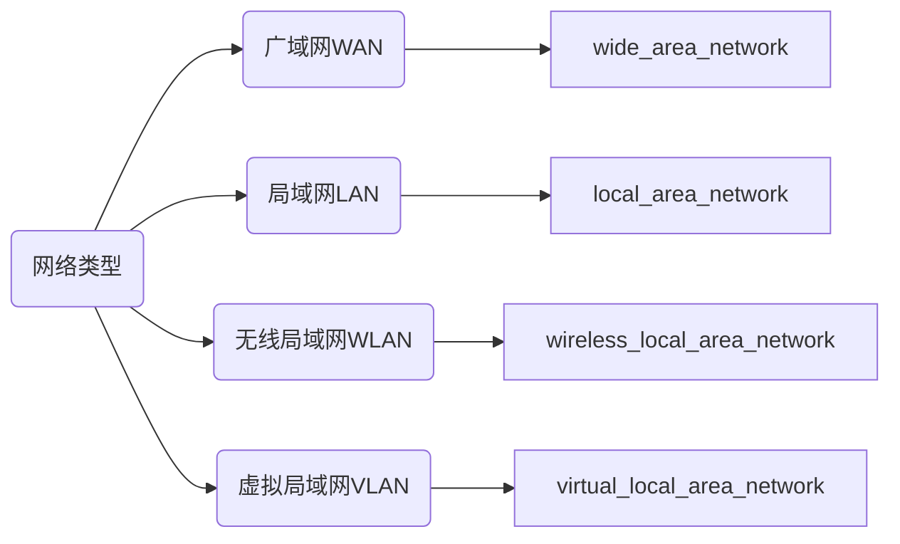

# 计算机网络


## 一、引子

### 1.1 网络流程问题

**在浏览器里输入https://www.baidu.com
按下回车，看到内容后，背后发生了什么？**

数据封装
交换机和路由器的工作原理
arp协议
http协议
web服务器
dns

### 1.2 运维流程


### 1.3 公司实际网络流程图


## 二、概况

### 2.1 现状

1. 国内阿里云做的最好
2. 网络工程师逐渐没落，原因是云时代的到来，无人再买服务器，转而购买大厂的云服务器
3. 2021年中国网民约10亿

### 2.2 目的

对于我：

1. 面试必问
2. 考研必考

对于实际应用：

1. 连接n台电脑，构成网络，提高管理效率（n=10,100,1000,...)
2. 工作中排查故障

### 2.3 大致内容

TCP/IP（几乎所有内容都围绕此展开）


(https://www.baidu.com问题就会从TCP/IP五层模型来解答)


## 三、基本术语

### 3.1 网站开发结构



### 3.2 协议

tcp/ip协议族： tcp ，ip ，icmp，arp，dhcp，http，udp等

ping

### 3.3 标准

5G标准：华为，高通，三星，爱立信，诺基亚等--》协议

### 3.4 WAN



### 3.5 交换机和路由器

##### 路由器

(router)（少）

把数据从一个网络送到另外一个网络，可以跨网段通信
192.168.0.1~254
192.168.100.1~254


##### 交换机

(switch)（多）

组建局域网，把电脑连接起来可以互相通信

无线路由器 -->无线交换机

接口多，8,16,24,48


##### 厂商

H3C：属于华为，在杭州，高端

华为：高端

Cisco：美国，高端

TP-Link：性价比极高，满足一般需求

锐捷：校园网


##### 网速

百兆：

100 Mbps = 100/8 MBps

10MBps   mb per second

byte 字节  -->B
bit  位   -->b
1 byte = 8 bit

三创的网络是电信网，300Mbps 300/8=37.5MB，但由于交换机的每个端口最大100Mbps，所以网速被限制了


### 3.6 防火墙

其实就是高级的路由器，对进出数据进行过滤


### 3.7 VPN

Virtual Private Network  虚拟专用网络

在公用网络上建立专用网络，进行加密通讯。


### 3.8 拓扑结构

网络分为三层：

接入层

汇聚层

核心层


星型拓扑结构

优点：易于实现，扩展性好，利于故障排查

缺点：计算机过多时中心节点压力大，组网成本高


网型拓扑结构

各个结点至少与其他两个结点相连

可靠性高，成本也高


## 四、TCP/IP模型

### 4.1 模型总览


### 4.2 OSI模型和TCP/IP模型

#### OSI七层模型

**==应表会传往（网）树（数）屋（物）==**

概念模型，没有真正实现


#### TCP/IP五层模型的相关协议


|      |                |                              |
| ---- | -------------- | ---------------------------- |
| HTTP | 超文本传输协议 | Hyper Text Transfer Protocol |
| FTP  | 文件传输协议   | File Transfer Protocol       |
| DNS  |                |                              |
| SMTP |                |                              |
|      |                |                              |


### 4.4 封装与拆包

**封装**

从应用层到物理层

**封装过程**


**拆包**

从物理层到应用层

**拆包过程**


## 五、物理层（网线）

### 5.1 信号

在Linux中就是进程和进程之间的通信

分为模拟信号和数字信号

数字信号更好，抗干扰能力强，传输距离远并能保证质量


### 5.2 网线

RJ-45接口

网线的线序

==T568B：白橙、橙、白绿、蓝、白蓝、绿、白棕、棕==


### 5.3 办公室网络布线 

解决问题：一个普通办公室组建一个办公网络要多少钱？

 清单：
	26*2=52 
	交换机：tp_link 1000M  5*400=2000
	路由器： 华三 800  5个无线TP_LINK 200    1800
	线：5*26*2=260   305  609
	打孔：4*80=320
	工具+水晶头=100
总价： 2000+1800+609+320+100 = 4829

工价：
	2个人： 2天
	300*2*2=1200
6000 


## 六、数据链路层（交换机）

### 6.1 功能

1. 数据链路的建立、维护与拆除
2. **帧包装、帧传输、帧同步**
3. **帧的差错恢复**
4. 流量控制


### 6.2 以太网

#### 6.2.1 什么是以太网

以太网的MAC地址：网卡里面有，一个网卡有一个mac地址

mac地址也叫硬件地址，也叫物理地址

用16进制表示


#### 6.2.2 以太网帧格式

数据中的MTU： 最大传输单元（maximum transmission unit） 1500
帧： 18个字节  源mac地址+目的mac地址+类型+校验值 + 数据 46~1500  64~1518


### 6.3 交换机的工作原理

#### 6.3.1 功能

交换机是一台电脑，用来组建局域网，实现了局域网的通信，只有两种功能：

**1、学习**

学习各台电脑的mac地址，并将其存入mac地址表，mac地址表存放在交换机的内存中，交换机可以学习mac地址，并按mac地址来决定转发形式。（关机后需重来）

内存分为

rom： read only memory 只读存储器

ram：random access memory 随机存取存储器  --》内存  --》停电会丢失


**2、转发**

1. 当目的mac在mac地址表里没有的时候，给其他的接口都转发一份数据帧 --》广播

2. 收到目的mac是FF:FF:FF:FF:FF:FF 这种帧的时候--》广播（FF:FF:FF:FF:FF:FF-->数据帧里的广播地址 -->广播帧）

   2层广播地址：FF:FF:FF:FF:FF:FF

   3层广播地址： 192.168.0.0/24  -->192.168.0.255 

3. 当目的mac在mac地址表里有的时候，只是转发到对应的接口--》单播


#### 6.3.2 ARP协议

ARP协议在数据链路层的应用

​		在只知道源目标A机ip地址、mac地址和局域网内目标机B机ip地址（这些ping命令都可以知道）的情况下，要想知道B机的mac地址，就要使用arp协议发送报文来获取B机ip地址。

ARP协议获取mac地址过程：

​		首先，**每个交换机里面有一个mac地址表，每台计算机里面都有一个ARP缓存表**

​		在ping包发出之前，如果源机的arp缓存表里没有ip对应的mac地址,我们的电脑会发一个arp广播包，这个广播包的目标mac地址为FF:FF:FF:FF:FF:FF，交换机学习这个包的时候，判定为广播，便会广播出去搜索到对应目标ip地址的目标机，并通过单播的形式返回给源机目标机的mac地址，同时将mac地址存入交换机的mac地址表里面，从而完成获取。


arp 协议有2种类型的数据包

1.请求包 arp request 

​	请求得到某个ip对应的mac地址

2.响应包  response

​	把自己的ip对应的mac地址告诉对方


#### 6.3.3 !!!Linux实操!!!

1、怎么查看本机的MAC地址？

ip add 或者 ifconfig 命令 （Linux）

ipconfig -all（Windows）

ethernet  以太网--》局域网--》mac地址


2、怎么获得整个局域网的全部IP地址？

需要写一个脚本

先ping

再arp -a


**3、写一个脚本**

==**实现一个命令知道整个局域网里面有哪些ip地址在使用，以及这些ip地址对应的mac地址**==


虚拟机的虚拟网络适配器：


主要命令就是ping：用来测试网络是否畅通（通过ICMP协议）


源码：

```shell
#!/bin/bash
  
#清空先前的日志文件
>used_ip.txt
>unused_ip.txt

#遍历整个网段，一个一个地ping得到ip地址
for i in {1..254}
do
        #使用ping命令来测试这个ip地址是否使用
        (ping 192.168.0.$i -c 1 -w 1 &>/dev/null
        #如果能够ping通，说明$?返回值为0，写到used_ip.txt如果不通，就写到unused_ip.txt文件里面
        if (($? == 0))
        then
                # echo "192.168.0.$i is used"
                echo "192.168.0.$i" >>used_ip.txt
        else
                # echo "192.168.0.$i is unused"
                echo "192.168.0.$i" >>unused_ip.txt
        fi) &
done
wait

echo "####################used ip detail###################"
#先输出所有有效ip地址
cat used_ip.txt

#统计并输出有效ip地址的个数
num=$(cat used_ip.txt|wc -l)
echo "一共有以上 $num 个ip地址在使用"

echo "#################### arp 缓存表 #####################"

# 得到arp缓存表里的有效ip对应的mac地址
# arp -a
# 运用管道优化输出
# awk是截取命令，输出固定字节
# grep是文本过滤命令，-v取反，消去incomplete字节
# tr是文本转换命令，-d删除，消去ip地址两边的括号
arp -a|awk '{print $2,$4}'|grep -v "incomplete"|tr -d '()'

echo "####################################################"

# 可优化点
#   
```


## 七、网络层（路由器）


IP地址是计算机在网络中的唯一标识，是计算机的身份证，用于计算机之间通信

IP地址有两种：

| 种类 | 位数  |      个数      |   现况   |
| :--: | :---: | :------------: | :------: |
| IPV4 | 32位  | $2^{32}$(43亿) | 主流常用 |
| IPV6 | 128位 |   $2^{128}$    |  在使用  |

### 7.1 子网掩码

子网掩码（subnet mask）用来显示IP的**网络地址或者是网络位有多少位**有多少位（网段号）

子网掩码获取网络地址过程->


### 7.2 子网划分（A、B、C类IP地址）

#### 7.2.1 IP地址分类

​		首先，A类地址127.0.0.1作为唯一的环回地址使用，用来在每台计算机测试tcp/ip协议，只能在本地访问，别人不能访问


可容纳主机数量：A>B>C


==这个图很重要每个数据都要背记==，为什么主机数量都要-2？是因为减去了**全0的子网号**和**全1的广播地址**。


网络又分为公网和私网

公网上同时有A、B、C三类IP地址

而私网的私有IP段有以下三种：

**A	10.x.x.x**

**B	172.16~31.x.x**

**C	192.168.0~255.x.x**


#### 7.2.2 子网划分实例

意义：方便管理，方便识别

划分原则：网络位向主机位借位（一般最多借六位，即每个网段有$2^2-2=2$个主机）

实例：

<u>将192.168.1.0划分成4个子网，求每个子网的有效IP地址段，子网掩码，广播地址。</u>

（每个子网可容纳主机数都一样）


Step1：划分出四个子网需要向主机位借两位二进制位数，借此求出四个可用网段，即求主机位借出去的两位


Step2：求主机位剩下的六位，即每个网段都有1~62（$2^6-2$）共62种可能（**平均**分的，减去了子网号和广播地址）


Step3：把剩下的六位加到借去的两位上，得到结果如下

|       | 有效IP地址段      | 子网掩码 | 广播地址           |
| ----- | ----------------- | -------- | ------------------ |
| 网段1 | 192.168.1.1~62    | ...63    | 255.255.255.192    |
| 网段2 | 192.168.1.65~126  | ...127   | (借去的两位128+64) |
| 网段3 | 192.168.1.129~190 | ...191   | (同上)             |
| 网段4 | 192.168.1.192~254 | ...255   | (同上)             |


- 实际上出题更多是逆运算，给出某一个网段的ip地址，求各ip地址段
- 实际中使用不会只划分一次，一般会多次对划分出来的分支网段再进行子网划分（像二叉树一样）

 

<u>例一：计算159.64.25.100/25地址的子网地址，广播地址以及子网的有效IP范围</u>

159.64.25.01100100

159.64.25.10000000

159.64.25.00000000


得到子网号159.64.25.0，开始计算网段长度：

$2^7-2=126$，也就是说长度是1~126，得表如下：

|       | 有效IP地址段      | 子网掩码 | 广播地址        |
| ----- | ----------------- | -------- | --------------- |
| 网段1 | 192.168.1.1~126   | ...127   | 255.255.255.128 |
| 网段2 | 192.168.1.129~254 | ...255   | 255.255.255.128 |


例二：192.168.99.0/24 平均划分成8个子网，计算每个子网的有效ip地址段，子网掩码，广播地址

平均划分成8个子网主机位需要借3位，也就是192.168.99.000|00000，则有以下网段

| 可能的借去二进制IP地址 | 对应的可用网段 |
| :--------------------: | :------------: |
|          000           |  192.168.99.0  |
|          001           | 192.168.99.32  |
|          010           | 192.168.99.64  |
|          011           | 192.168.99.96  |
|          100           | 192.168.99.128 |
|          101           | 192.168.99.160 |
|          110           | 192.168.99.192 |
|          111           | 192.168.99.224 |

又$2^5-2=30$，则网段长度为1~30，加到对应可用网段上可以得出：

|       | 有效IP地址段      | 子网掩码 | 广播地址              |
| ----- | ----------------- | -------- | --------------------- |
| 网段1 | 192.168.1.1~30    | ...31    | 255.255.255.224       |
| 网段2 | 192.168.1.33~62   | ...63    | (借去的两位128+64+32) |
| 网段3 | 192.168.1.65~94   | ...95    | 同上                  |
| 网段4 | 192.168.1.97~126  | ...127   | 同上                  |
| 网段5 | 192.168.1.129~158 | ...159   | 同上                  |
| 网段6 | 192.168.1.161~190 | ...191   | 同上                  |
| 网段7 | 192.168.1.193~222 | ...223   | 同上                  |
| 网段8 | 192.168.1.225~254 | ...255   | 同上                  |


### 7.3 路由器（可以看作一台电脑）

#### 7.3.1 路由和路由器定义

**路由**

源主机（SA）通过一个互联网络向目标主机（DA）发送数据包的过程。


**路由器**

- **实现跨网段通信，本质上是将数据从一个子网送到另外一个子网。**
- IP包经过路由器时，路由器可以修改它的源IP和目的IP，但是**每次经过路由器mac地址一定会改变**。 
- 路由器内有一个路由表（存在内存里面），如果路由表里面没有合适的路由条目，这条数据输入路由器就会直接丢失。


```ip route```		查看路由表 

```arp -a```		查看arp缓存表

```cat /etc/resolv.conf```		查看DNS服务地址


|        | 作用       | 表（都是存在内存中，关机就丢失） | 数据形式                                                     |
| ------ | ---------- | -------------------------------- | ------------------------------------------------------------ |
| 交换机 | 组建局域网 | mac地址表                        | 帧（源mac和目的mac)（交换机无法修改）                        |
| 路由器 | 组建广域网 | 路由表，arp缓存表                | 包（源ip和目的ip，如果使用NAT则会修改它们）（每次经过都会修改包中帧的mac地址） |


#### 7.3.2 路由配置时的类型

1. 直连路由：给自己接口配置上IP，并且激活，会自动产生，不需要配置
2. 静态路由：需要手工添加，单向，不直连的网段，都需要添加
3. 动态路由
4. 默认路由：是特殊的静态路由，用0.0.0.0代表任意ip

（平时电脑添加一个网关，其实就是添加了一个默认路由）

|          | 目标网段     | 子网掩码      | 下一跳       |
| -------- | ------------ | ------------- | ------------ |
| 静态路由 | 192.168.30.0 | 255.255.255.0 | 192.168.20.2 |
| 默认路由 | 0.0.0.0      | 0.0.0.0       | 192.168.20.2 |

当同时存在时，优先级：直连路由 > 静态路由 > 动态路由 > 默认路由


路由器组建网络实验

1. 给PC机：配置ip和网关
2. 给路由器：接口配置IP和静态路由
3. 测试是否ping通过


拿对方的ip地址和自己的子网掩码进行与运算得到网段号，然后马上查路由表，看是否有能达到的路由。


#### 7.2.4 路由器转发数据包的封装过程


### 7.4路由器相关实验

#### 7.4.1 Linux配置IP地址

**第一步，进入网卡配置文件目录==/etc/sysconfig/network-scripts/==**

```shell
cd /etc/sysconfig/network-scripts/
vim ifcfg-ens33
```


**第二步，修改你的网卡配置文件，例如"ifcfg-ens33"**

"ens33" 是具体接口的名字

"lo" 是环回接口

```shell
BOOTPROTO="none" #指定是用静态配置还是动态配置，none为静态
NAME="ens33"
DEVICE="ens33" #网卡的名字
ONBOOT="yes" #yes表示开机的时候激活这个网络连接
IPADDR=192.168.0.1 #IP地址
PREFIX=24 #子网掩码的长度为24，相当于 255.255.255.0
GATEWAY=192.168.0.1 #设置网关，可删掉，会自动配置默认网关
DNS1=114.114.114.114 #首选DNS服武器
DNS2=192.168.0.1 #备选DNS服武器
```


**第三步，重新启动服务**

1. centos8里

   ``` ifup ens33```

2. centos7里

   ```service  network  restart``` 		刷新网络服务


#### 7.4.2 路由配置实验Packet Tracer（未实操）


#### 7.4.3 路由配置实验Linux虚拟机

实验目的：熟悉Linux环境下配置ip地址，以及查看路由和开启路由的功能

实验步骤：

1.实验环境准备

两台虚拟机，各自拥有两块网卡

2.为所有网卡配置IP地址


### 7.5 IP和DNS常用命令

#### 1. ping命令的使用

```shell
ping -c n  数量 
ping -W [ -W timeout]  超时时间
ping -w [ -w deadline]  期限  设置一个固定的时间为截止时间
ping -s n 指定ping包数据的大小

ping  www.baidu.com  -s 1000  看一个小时 是否丢包
ping命令的作用：
	1.测试网络的连通性
	2.测试网络的质量：丢包率，响应时间长短
```


ping不通的三种情况

| 报错情况         | 错误原因                        |
| ---------------- | ------------------------------- |
| 网络不可达       | 没有填写网关ip或者填写错误      |
| 目的主机不可达   | ip没有被使用                    |
| 未知的名称或服务 | 没有填写DNS服务器地址或者填错了 |


#### 2. DNS查看方式

ifcfg-ens33		配置文件可以决定/etc/resolv.conf文件里的nameserver的ip地址

resolv.conf		是真正工作的提供dns服务器地址的文件


==查看dns服务器地址(背这个命令）==

```cat  /etc/resolv.conf```

输出：

Generated by NetworkManager

nameserver 114.114.114.114

nameserver 192.168.0.1


查看默认网关
```ip  route```


三次握手四次断开


ICMP协议


ARP协议

域名转IP地址，IP地址再转Mac


ARP协议在工作时有两种类型的数据包

1. ARP request
2. ARP response


从封装的角度去理解

网络层

数据链路层


NAT协议（Iptables)（2天）


无线网络